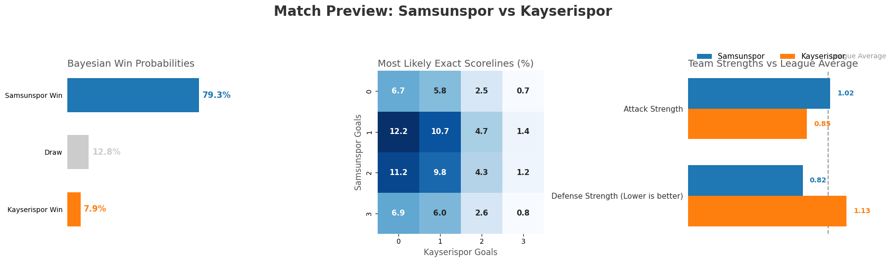

# Transforming Football Chaos into Predictive Intelligence

Football is inherently chaotic. A rogue bounce, a momentary lapse in concentration, or a controversial refereeing decision can upend 90 minutes of tactical dominance. But beneath this chaos lies a pulse—a rhythm of mathematical probability that can be measured, modeled, and predicted.

This project is a multi-stage data science pipeline that transmutes raw, historical football match data (specifically from the Turkish Süper Lig) into highly accurate, dynamically adjusting predictions. It doesn't just calculate who will win; it learns from history, accounts for human psychology on the pitch, and visually tells the story of the data.

Here is the technical anatomy of how this predictive oracle is built.

---

## The Alchemy of Strengths (Feature Engineering)

Raw data—goals, corners, and yellow cards—tells us what *happened*, but not *why* it happened. To predict the future, we first decouple a team's performance from their opponents by benchmarking them against the global reality of the league.

We engineer two core metrics for every team, both at home and away: **Attack Strength** and **Defense Fragility**.

### Attack Strength

Measures a team's offensive lethality relative to an average team:

$$Attack\_Strength = \frac{Team\_Average\_Goals\_Scored}{League\_Average\_Goals\_Scored}$$

> A score of **1.50** means the team scores 50% more goals than the league average.

### Defense Fragility

Measures a team's defensive leaks:

$$Defense\_Strength = \frac{Team\_Average\_Goals\_Conceded}{League\_Average\_Goals\_Conceded}$$

> A lower score is better — **0.80** means they concede 20% fewer goals than average.

By applying this exact mathematical framework to secondary markets, the pipeline also generates expected values for match **corners** and **yellow cards**.

---

## The Poisson Engine (Expected Goals)

With our isolated strengths calculated, we pit the two teams against each other to calculate Expected Goals ($\lambda$). This is the foundational pulse of the predictive model.

$$\lambda_{home} = Attack_{home} \times Defense_{away} \times LeagueAvg_{home}$$

$$\lambda_{away} = Attack_{away} \times Defense_{home} \times LeagueAvg_{away}$$

Because football goals are rare, discrete events occurring over a fixed interval (90 minutes), they perfectly fit a **Poisson Distribution**. By feeding our Expected Goals ($\lambda$) into the Poisson Probability Mass Function, we generate a bivariate probability matrix for every possible scoreline (from 0–0 up to 10–10):

$$P(k) = \frac{\lambda^k e^{-\lambda}}{k!}$$

By summing specific regions of this matrix, we derive our base probabilities:

- **P(Home Win)** — Sum of all matrix cells where Home Goals > Away Goals
- **P(Draw)** — Sum of the main diagonal (Home Goals = Away Goals)
- **P(Away Win)** — Sum of all matrix cells where Home Goals < Away Goals

---

## The Dixon-Coles Adjustment

Standard Poisson models have a fatal flaw: they assume goals are entirely independent. Anyone who watches football knows this is false. When a game is tied 0-0 or 1-1 late in the second half, teams alter their tactics, often playing more conservatively to protect a point.

To bridge the gap between pure mathematics and human psychology, the pipeline applies the **Dixon-Coles $\rho$ (rho) adjustment**.

Using a $\rho$ parameter (typically around $-0.15$), the algorithm artificially inflates the probability of low-scoring and tied outcomes (0–0, 1–0, 0–1, and 1–1) and recalibrates the overall match probabilities. This ensures the model doesn't just predict goals, but predicts *football*.

---

## Gamma-Poisson Bayesian Update

A Frequentist model looks at a team's season-long averages and stops there. But some teams simply have another team's "number." A mid-table club might inexplicably dominate a league giant at home year after year due to historical rivalries or psychological blocks.

To capture this, the pipeline applies a **Bayesian Posterior Update** using a Gamma-Poisson conjugate. It allows the model to "learn" from reality.

1. **The Prior** — Our Dixon-Coles adjusted probabilities serve as our initial belief.

2. **The Expected Baseline ($\alpha$)** — We multiply our Prior by the number of historical head-to-head matches ($\beta$):

$$\alpha = \beta \times P(outcome)$$

3. **The Likelihood (Observed Evidence)** — We count the actual historical outcomes (Wins, Draws, Losses) between these two specific teams.

4. **The Posterior ($\alpha'$)** — We update our baseline with the cold, hard reality of their past encounters:

$$\alpha' = \alpha + Observed\_Outcomes$$

Finally, we normalize the $\alpha'$ values. The result is a dynamically updated probability that seamlessly blends a team's current season form with their historical head-to-head dominance.

---

## Storytelling with Data

A brilliant mathematical model is useless if its insights are buried in spreadsheets. The final layer of this pipeline is an interactive presentation engine built on the philosophies of Cole Nussbaumer Knaflic’s Storytelling with Data.

Rather than forcing the user to interpret the data (exploratory visualization), the dashboard guides the user directly to the insight (explanatory visualization) using psychological design principles:

- **Eradicating Chartjunk** — Gridlines, secondary axes, and heavy borders are stripped away to maximize the data-to-ink ratio. The data is allowed to breathe.

- **Pre-attentive Attributes** — We avoid the "rainbow effect." A strict, muted color palette pushes context to the background, while bold, consistent colors (**Blue** for Home, **Orange** for Away) instantly draw the eye to the key metrics.

- **Direct Labeling (Reducing Cognitive Load)** — Legends and X-axes are eliminated wherever possible. Exact probabilities and team names are written directly onto the bars and line charts, saving the user's brain from bouncing back and forth across the screen.

- **The Bayesian Slopegraph** — The impact of the Gamma-Poisson update isn't explained with text; it is *shown* visually. A slopegraph directly connects the base Poisson prediction to the updated Bayesian Posterior, instantly highlighting exactly how much historical head-to-head data shifted the odds.

---

> This pipeline doesn't just calculate numbers — it engineers features, respects the tactical realities of the sport, learns from history, and tells a compelling visual story.